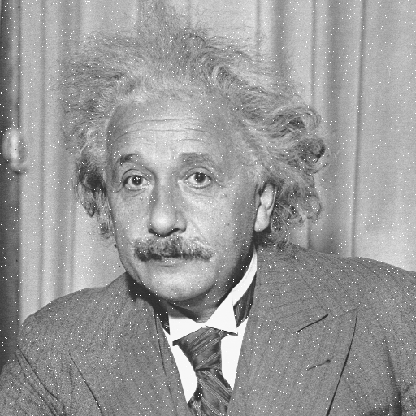

# Aplicação do Filtro de Mediana em Imagens PGM

## 1. Introdução

No processamento de imagens, a remoção de ruídos é uma tarefa fundamental para melhorar a qualidade das imagens. Um dos métodos mais eficientes para eliminar ruídos em imagens é o **filtro de mediana**, amplamente utilizado para suavizar imagens enquanto preserva bordas e detalhes importantes. O formato de imagem **PGM (Portable Graymap)**, por ser simples e de fácil manipulação, é comumente utilizado em projetos de processamento de imagens.

Neste projeto, aplicamos o filtro de mediana em imagens no formato PGM, utilizando a linguagem Rust. O filtro de mediana é eficaz para remover ruídos como o "ruído sal e pimenta", que consiste em pixels com valores extremos dispersos pela imagem.

## 2. Funcionamento do Filtro de Mediana

### 2.1 O que é o Filtro de Mediana?

O filtro de mediana é um algoritmo de suavização não linear que funciona substituindo cada pixel da imagem pela **mediana** dos valores de seus vizinhos em uma janela ao redor do pixel. A mediana é escolhida porque é menos sensível a valores extremos (ruídos) do que a média, o que o torna mais eficiente para a remoção de ruídos sem desfocar significativamente a imagem.

### 2.2 Implementação do Filtro de Mediana

O algoritmo implementado neste projeto segue os seguintes passos:

1. **Leitura do Arquivo PGM**: A imagem PGM é lida e seus dados são processados. O cabeçalho do arquivo, que contém as dimensões da imagem e o valor máximo de pixel, é interpretado corretamente, ignorando comentários ou linhas não relevantes.
2. **Aplicação do Filtro**: Para cada pixel da imagem, uma janela 3x3 é construída ao redor do pixel central. Os valores dessa janela são coletados, ordenados, e a mediana é selecionada para substituir o valor original do pixel.
3. **Escrita da Imagem Filtrada**: Após o processamento, a nova imagem filtrada é escrita em um arquivo PGM, mantendo o formato original, mas com o nome do arquivo modificado para incluir o sufixo "_modified".

A implementação em Rust garante eficiência e segurança, características que tornam o código robusto e fácil de manter. Aqui está um exemplo básico do funcionamento do filtro de mediana:

```RUST
fn apply_median_filter(width: u32, height: u32, pixels: &Vec<u8>) -> Vec<u8> {
    let mut output = pixels.clone();
    
    let neighbors = |x: i32, y: i32| -> Vec<u8> {
        let mut values = Vec::new();
        for dx in -1..=1 {
            for dy in -1..=1 {
                let nx = x + dx;
                let ny = y + dy;
                if nx >= 0 && ny >= 0 && nx < width as i32 && ny < height as i32 {
                    let idx = (ny as u32 * width + nx as u32) as usize;
                    values.push(pixels[idx]);
                }
            }
        }
        values
    };

    for y in 0..height {
        for x in 0..width {
            let values = neighbors(x as i32, y as i32);
            let mut sorted_values = values.clone();
            sorted_values.sort();
            let median = sorted_values[sorted_values.len() / 2];
            let idx = (y * width + x) as usize;
            output[idx] = median;
        }
    }

    output
}
```

## 3. Exemplos de Uso e Resultados

### 3.1 Exemplo de Uso

Para processar uma ou várias imagens PGM e aplicar o filtro de mediana, basta executar o programa no diretório que contém as imagens:

```bash
cargo run
```

O programa irá buscar todos os arquivos com extensão `.pgm` no diretório `assets`, aplicar o filtro de mediana, e salvar as novas imagens no diretório `./src/filtered_images`, com o sufixo `_modified` no nome do arquivo.

### 3.2 Resultados

Exemplo de imagens processadas:

- Imagem original:


- Imagem filtrada: `src/filtered_images/einstein_modified.pgm`


Comparando as imagens, é possível observar que os ruídos foram significativamente reduzidos enquanto as bordas e os detalhes principais da imagem foram preservados.

## 4. Desafios e Soluções

### 4.1 Desafios

Durante o desenvolvimento, alguns dos principais desafios enfrentados foram:

- **Compatibilidade com diferentes arquivos PGM**: Algumas imagens PGM continham comentários ou formatos ligeiramente diferentes, o que causava falhas na leitura correta do arquivo.
- **Manutenção da Estrutura da Imagem**: Ao aplicar o filtro de mediana, era necessário garantir que as bordas da imagem fossem tratadas corretamente, sem extrapolar os limites da imagem.
- **Tratamento de Múltiplas Imagens**: O código precisava ser capaz de processar múltiplos arquivos PGM em um diretório automaticamente, o que exigiu ajustes na lógica de leitura e escrita dos arquivos.

### 4.2 Soluções Adotadas

- **Ignorar Comentários no Arquivo PGM**: O código foi ajustado para ignorar linhas de comentário e processar apenas os dados relevantes da imagem.
- **Tratamento de Borda no Filtro**: O filtro foi implementado de maneira que, ao processar pixels nas bordas, ele considera apenas os vizinhos válidos, garantindo que a imagem não extrapole os limites definidos.
- **Processamento Automático de Diretórios**: Implementamos uma lógica para percorrer todos os arquivos `.pgm` em um diretório, aplicando o filtro em cada um deles e gerando a saída filtrada com um nome modificado.